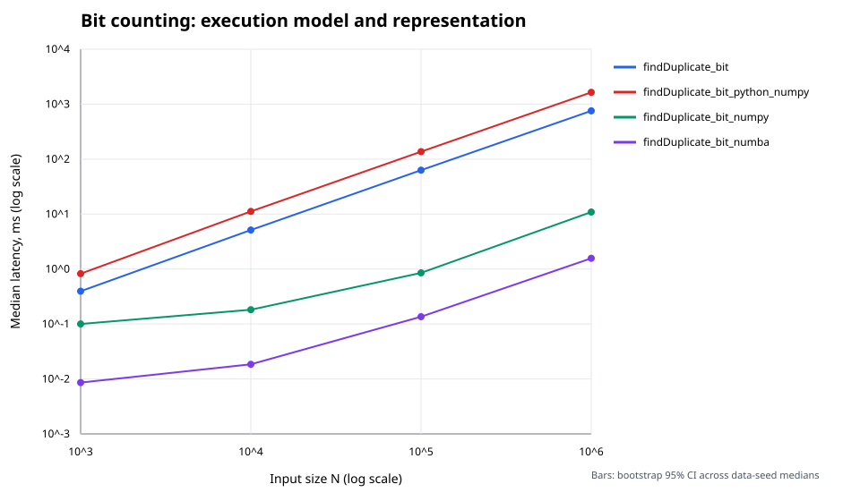

# Python Performance: From Objects to Memory Access

This repository studies how interpreter overhead, representation, allocation,
memory locality, and compilation affect a small duplicate-finding problem. It then
applies the same measurement discipline to batched embedding bags, a common ML
inference operation. It is an experimental study, not a claim that one algorithm is
universally fastest.

## Questions investigated

- What changes when identical Python bytecode iterates over boxed list integers or
  NumPy scalar objects?
- How much time is removed by NumPy vectorization and Numba compilation?
- When does vectorization allocate large intermediate arrays?
- Do independent input permutations change the conclusion?
- Can compiler output and hardware counters support a proposed explanation?
- Does fusing embedding gather and reduction avoid a materialized tensor?

For a deeper defense of the mechanisms, evidence, and experimental boundaries, see
the [Python and ML systems technical analysis](docs/technical-analysis.md).

## Install and test

```bash
python3 -m venv .venv
.venv/bin/python -m pip install --upgrade pip setuptools
.venv/bin/python -m pip install -e '.[dev]'
.venv/bin/python -m pytest -q
```

To recreate the package versions used for the published controlled experiment,
install with Python 3.10.12 and
`-c constraints/controlled-python310.txt`. The embedding artifact has a separate
`constraints/embedding-python310-cu124.txt` because it used a different NumPy and
PyTorch environment.

```bash
.venv/bin/python -m pip install \
  -c constraints/controlled-python310.txt -e '.[dev]'
```

PyTorch is optional because it is a large dependency:

```bash
.venv/bin/python -m pip install -e '.[ml]'
```

CI runs the complete non-PyTorch suite on Python 3.9 and 3.12. The current suite
covers every registered implementation, input preservation, structured metadata,
multi-seed serialization, isolated memory measurement, and batched embeddings.

## Python runtime explainer

[`docs/python-runtime-report.md`](docs/python-runtime-report.md) connects the timing
results to observable runtime details: `dis` bytecode, `sys.getsizeof`, ndarray dtype
and strides, separate fresh-process `tracemalloc` and RSS measurements, and a
two-core GIL experiment.

On the recorded CPython 3.10 build, 10,000 referenced integers plus their list
container occupied about nine times the bytes of an owning `int32` ndarray. Two
CPU-bound Python tasks were slower in two Python threads than sequentially, while an
equivalent Numba `prange` reduction achieved modest native parallel speedup. The
report stores raw evidence in
[`results/ryzen-7535hs-python-runtime.json`](results/ryzen-7535hs-python-runtime.json)
and explains why tracing and RSS must be measured in separate processes.

```bash
NUMBA_NUM_THREADS=2 taskset -c 2,4 .venv/bin/python \
  bench/explain_python_runtime.py \
  --json results/my-host-python-runtime.json \
  --markdown docs/python-runtime-report.md
```

### CPython 3.14 free-threading

A separate standard-library-only experiment runs identical bytecode under matching
CPython 3.14.6 standard and free-threaded builds. Using no third-party extensions
ensures an imported module cannot silently re-enable the GIL.

On two distinct physical cores, the standard build completed two threaded tasks with
0.91x the throughput of sequential execution. The free-threaded build achieved 1.94x
throughput, while one free-threaded task was 48.2% slower than the matching standard
build. This exposes the trade-off: CPU-bound Python threads can run in parallel, but
thread-safe runtime machinery can increase single-thread cost.

See the generated [free-threading report](docs/python314-free-threading.md) and
[raw samples](results/ryzen-7535hs-python314-free-threading.json).

```bash
taskset -c 2,4 .venv/bin/python bench/compare_free_threading.py \
  --interpreters python3.14 python3.14t \
  --json results/my-host-python314-free-threading.json \
  --markdown docs/python314-free-threading.md
```

## Controlled execution and representation matrix

The central comparison holds the bit-counting algorithm constant:

| Implementation | Execution | Input representation |
| --- | --- | --- |
| `findDuplicate_bit` | CPython loop | `list[int]` |
| `findDuplicate_bit_python_numpy` | same CPython function | `numpy.int32` array |
| `findDuplicate_bit_numpy` | NumPy operations | `numpy.int32` array |
| `findDuplicate_bit_numba` | compiled Numba loop | `numpy.int32` array |

The same CPython function object is registered for the first two variants. This
isolates the cost of iteration and scalar conversion when moving from a list to an
ndarray without vectorizing the operation. Algorithm metadata—not naming
conventions—controls representation preparation, compilation warmup, reporting, and
temporary-memory guards.

```bash
NUMBA_NUM_THREADS=1 taskset -c 2 .venv/bin/python main.py \
  --algorithms findDuplicate_bit findDuplicate_bit_python_numpy \
    findDuplicate_bit_numpy findDuplicate_bit_numba \
  --sizes 1000 10000 100000 1000000 \
  --repeats 3 \
  --data-seeds 101 202 303 404 505 606 707 808 909 1010 1111 1212 1313 1414 1515 \
  --seed 777 --no-hugepages --cache-flush-mib 64 \
  --json results/my-host-controlled.json
```

Each data seed creates an independent permutation. Execution order is randomized
within each repeat. JSON retains every sample and reports a deterministic 95%
percentile-bootstrap interval across per-seed medians. The displayed point estimate
is the median of those same seed medians; repeat-level samples remain available as
technical replicates. Fifteen seeds improve input coverage but still do not turn the
interval into a portable population bound.

## Published experiment

The checked-in experiment was run on one core of an AMD Ryzen 5 7535HS, with one
Numba thread, ordinary pages, fifteen data seeds, and three samples per seed. A 64 MiB
buffer was read before each timed call as a best-effort LLC eviction step; this makes
the cache policy explicit but does not guarantee a completely cold hierarchy. Full
host, package, cache, affinity, configuration, execution-order, and raw-sample metadata are
in [`results/ryzen-7535hs-python310-controlled.json`](results/ryzen-7535hs-python310-controlled.json).



At `N=1,000,000`, median latency was 755.1 ms for the Python list, 1638.9 ms for the
same Python code over ndarray scalars, 10.89 ms for NumPy, and 1.57 ms for Numba.
The ndarray result demonstrates that packed storage alone does not make a Python
scalar loop fast: per-element ndarray scalar conversion made this loop about 2.2x
slower than list iteration. NumPy was about 69x faster than the list loop, while the
compiled Numba loop was about 482x faster. These are results from this host and
configuration, not portable constants.

The complete interpretation and limitations are in
[`results/ryzen-7535hs-analysis.md`](results/ryzen-7535hs-analysis.md).

## Isolated memory measurement

Memory is measured separately because a process-wide high-water mark cannot be
attributed to one implementation. The harness starts a fresh worker for each
algorithm, prepares its input and initializes compiled kernels, then monitors Linux
`VmRSS` externally at 1 ms intervals while the measured region runs.

```bash
taskset -c 2 .venv/bin/python bench/measure_memory.py \
  --algorithms findDuplicate_bit findDuplicate_bit_python_numpy \
    findDuplicate_bit_numpy findDuplicate_bit_numba \
  --size 1000000 --seed 303 --repeats 2 \
  --json results/my-host-memory.json
```

The published run observed about 7.7 MiB incremental peak RSS for the NumPy loop and
no resolvable additional RSS for Numba. A 1 ms polling sampler can miss very
short-lived allocations, and sub-page differences should be treated as zero rather
than precise allocation measurements.

## Batched ML workload

The embedding benchmark creates multiple non-empty bags with a shared `float32`
table and `int64` indices. NumPy gathers a `(lookups, dimension)` tensor before
reducing it; Numba fuses gather and accumulation; PyTorch uses its CPU
`embedding_bag` kernel on tensors created outside the timed region.

```bash
NUMBA_NUM_THREADS=1 taskset -c 2 python3 bench/run_embedding.py \
  --rows 100000 --dimension 128 --bags 256 --bag-size 128 \
  --repeats 3 \
  --data-seeds 101 202 303 404 505 606 707 808 909 1010 1111 1212 1313 1414 1515 \
  --order-seed 777 --locality random --torch-threads 1 \
  --cache-flush-mib 64 \
  --json results/my-host-embedding.json
```

The published artifacts use fifteen seeds. On the random-access run, median latency
was 999.8 ms for Python loops, 12.17 ms for NumPy gather/reduce, 1.91 ms for fused
Numba, and 1.31 ms for PyTorch. The gathered intermediate is 16 MiB. A paired
same-seed analysis found no sorting benefit: sorting was measurably slower for NumPy
(+6.23%) and Python loops (+2.32%), while the Numba and PyTorch direction remained
unresolved. See the [paired locality report](results/ryzen-7535hs-python310-embedding-locality-paired.md).

Numerical differences are measured against a float64 reference. Reduction order
differs between implementations, so the benchmark reports maximum absolute and
relative error rather than assuming bitwise equality.

## Compiler and hardware evidence

Capture the exact LLVM IR or assembly produced for the current environment:

```bash
.venv/bin/python bench/inspect_numba.py findDuplicate_bit_numba \
  --kind llvm --output results/my-host-bit-numba.ll
```

The published LLVM contains a `vector.body`, four-lane wide `i32` loads, vector
shifts, and vector additions in the hot counting loop. The complete IR and a metadata
sidecar with its signature, environment, and SHA-256 are checked in. Search markers
alone are not proof; the loop body must be inspected.

For hardware counters, imports, allocation, shuffling, and JIT warmup are completed
in a fresh worker before `perf` attaches to that blocked process:

```bash
CPU_SET=2 NUMBA_NUM_THREADS=1 \
  PERF_OUTPUT=results/floyd-perf.csv \
./bench/run_perf.sh findDuplicate_floyd_numba 10000000 5
```

After capturing comparable Floyd and sequential bit-counting runs, normalize them
with `bench/compare_perf.py`. The current checked-in case study does not include a
counter artifact because its capture host denied PMU access at
`perf_event_paranoid=4`; the command and analysis design are not presented as
measured evidence.

```bash
.venv/bin/python bench/compare_perf.py \
  results/floyd-perf.csv results/bit-perf.csv \
  --json results/perf-comparison.json \
  --markdown results/perf-comparison.md
```

Generic cache events do not measure DRAM bandwidth. CPU-specific memory-controller
events must be selected from `perf list`. Logical bytes scanned are not physical
DRAM traffic, and timing alone does not establish cache, TLB, or SIMD causality.

## Other implementations

The registry also includes sorting, set lookup, value-domain binary search, Floyd
cycle detection, temporary sign marking, a single-pass bit counter, a fully
broadcast NumPy variant, parallel Numba, and Numba Floyd. Comparisons across different
algorithm families intentionally mix algorithmic and execution-model effects; use
the controlled matrix for causal claims about representation and execution.

The broadcast variant is guarded by an estimated 1 GiB intermediate by default.
Dataset construction, conversion, and compilation remain outside normal timing.

## Optional host administration

Normal development and published timing do not require machine-wide changes.
Potentially disruptive scripts are isolated under [`bench/host_admin/`](bench/host_admin/)
and have explicit preview/status and restoration paths. Review them before using
`sudo`; they are not called by `run.sh`, `run_perf.sh`, CI, or tests.

## Interpretation boundaries

Floyd is O(N) time and O(1) space, but dependent accesses can limit prefetching.
Sequential bit counting performs O(N log N) logical work and may still win after
compilation. CPython complexity statements use the conventional word-RAM model;
Python integers themselves are variable-sized objects. Python integer negation may
allocate, but integers are not tracked by cyclic GC.

Results should not be compared across different representations, thread counts,
affinities, package versions, page configurations, or hosts as if only the algorithm
changed. The published data is a documented case study, not a universal ranking.

## Repository layout

- `src/duplicate_find/algorithms/`: implementations and structured registry.
- `src/duplicate_find/benchmark/`: timing, confidence intervals, metadata, and RSS measurement.
- `src/duplicate_find/ml/`: batched embedding-bag kernels.
- `bench/`: benchmark, plot, compiler-inspection, and `perf` entry points.
- `bench/host_admin/`: optional machine-wide Linux configuration.
- `tests/`: correctness and benchmark-contract tests.
- `docs/`: runtime reports and deeper technical analysis.
- `results/`: raw experimental artifacts, plots, compiler evidence, and interpretation.
